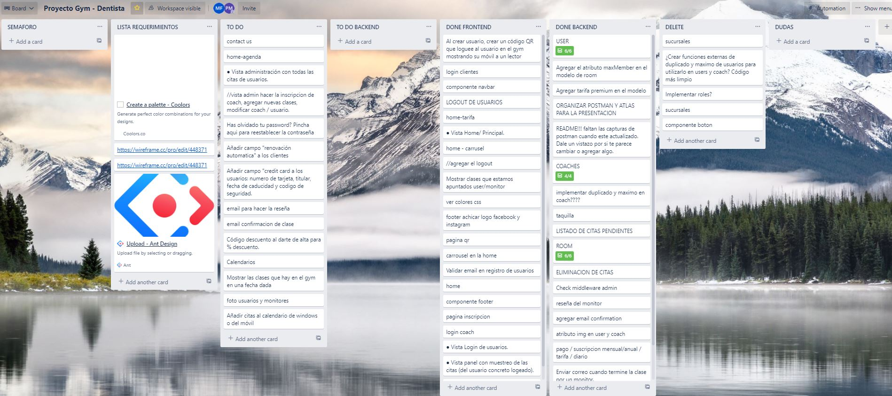
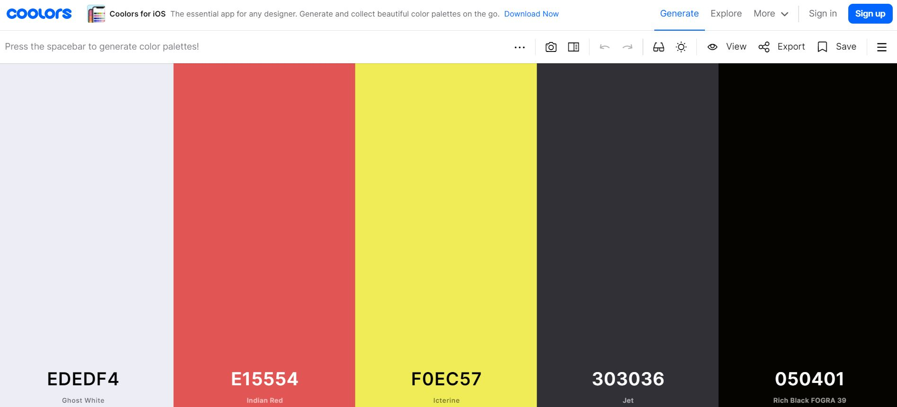
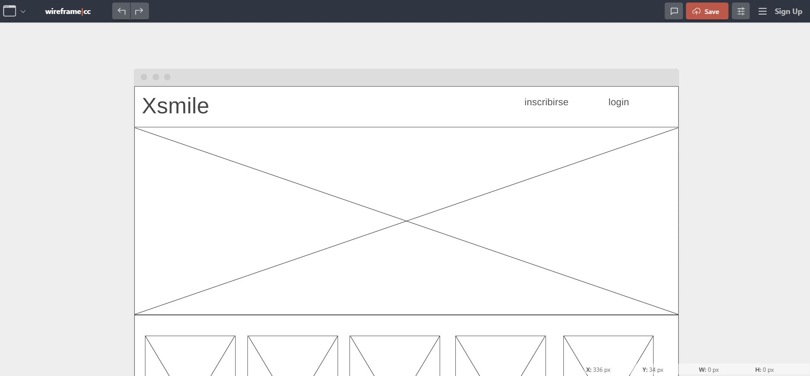

<a name="top"></a>

<h1 align="center">
  <br>Frontend Gym Appoinment
</h1>


:speech_balloon: [About](#id1)   

:hammer: [Tools](#id2)

:clipboard: [Instructions](#id3)

:eye_speech_bubble: [Phase I - Creating the Backend](#id4)

:exclamation: [Required and extra endpoints](#id5)

:mailbox: [Postman](#id6)

:computer: [Deploy](#id7)

:collision: [Coming Soon](#id8)

:smile: [Thanks](#id9)

---

<a name="id1"></a>
## **About**

This is the frontend for a future Gym appointment application.

This project is part of the [GeeksHubs Academy](https://bootcamp.geekshubsacademy.com/) Full Stack Developer Bootcamp. 

---
**Phase I**
**Start date:** 07 / Jun /2021
**Deadline:** 20 / Jun / 2021


**Contributors:**
* [Pedro Agulló Marco](https://github.com/PedroAgullo)
* [Mariana Fernández Sacristán](https://github.com/mlfernandez)

---

<a name="id2"></a>

## **Tools**

We have used these tools to help us in the project:

**Visual Studio Share**:

With this extension we were able to work simultaneously on the code and to do it together which helped us in the learning and development of the project.

**Trello:**

We used Trello to organise ourselves, to draw up the list of requirements and to see in detail how we were progressing and what we were missing.



**Coolors co:**

Coolors is the essential tool for creating and collecting color palettes. It allows you to generate perfect matching colors in seconds. 



**Wireframe cc:**

Wireframe is a minimalist web app for instantly creating wireframes.This can help users to create page schematics for websites or mobile apps. This web app does not require any complex configurations and all you have to do is to sketch out your ideas on a virtual drawing board.



Other tools used:

|  | React | 

|| Redux | 

|  | Visual Studio Code |

|  | JavaScript | 

|  | Node JS & Express |

|  | Git |

|  | GitHub | 


<a name="id3"></a>
***
## **Instructions**

<h3> Starting the project </h3>
   
We need to install:

```javascript
npx create-react-app "name"
npm i react-router-dom
npm i --save redux
npm install --save react-redux
npm i --save redux-localstorage-simple
npm i axios
```


<a name="id4"></a>
## Phase I Creating the Backend

If you want to know about the Phase I, you can see the backend repository here.


<a name="id5"></a>
## Required endpoints

* Vista Home / Principal.
* Vista Login de usuarios.
* Vista registro de usuarios.
* Vista panel con muestreo de las clases (del usuario concreto logeado).
* Vista administración con todas las clases.


<a name="id6"></a>
## Additional endpoints

**Monitor**

  * Monitor Register / Update
  * Monitor Create a new room
  * Find monitors class and update
  * Modify Monitor profile
 
**Room**

  * Join a user to the gym class:
    - Check if the user is already registered in that class.
    - Verify if the capacity of the class has been reached. 
  * Join a coach to the gym class:
    - Check if the trainer's speciality matches the gym classes to be taught.
    - Verify if that trainer doesn't have already a class at that time and day.
    - Check that there is no more than one trainer signed up to teach the class.
  * All active gym classes
  * Delete gym classes
  * Update gym classes status (create list of assistants to send an email for monitor review)
  * Monitor Leave the class.
  * User Leave the class.

**User**

  * Find all users
  * Find Users by email
  * Modify User

**Admin**

  * Update status member (annual, mensual or pending payment).
  * Create / Modify User
  * Create / Modify Coach
  * Create / Modify Room

<a name="id7"></a>
***
## **Deploy**

Frontend deployed AWS: https://master.d3s9s5rx5vhbgt.amplifyapp.com/

Admin Login: 
email: pedro@gmail.com
password: 123456

Coach Login:
email: david@gmail.com
password: 123456

User Login:
email: mariana@gmail.com
password: 123456


<a name="id8"></a>
***
## **Coming Soon**

* Deploy with Heroku.
* Review Form with export data implementation.
* Calendar.
* Rent locker.
* Card payment.
* Fixing Spinner.
* More search filters.

<a name="id9"></a>
***
## **Thanks**

Thanks to all our partners. Especially to our families for supporting us during the weeks we were missing.

<br>
<br>

[UP](#top)
